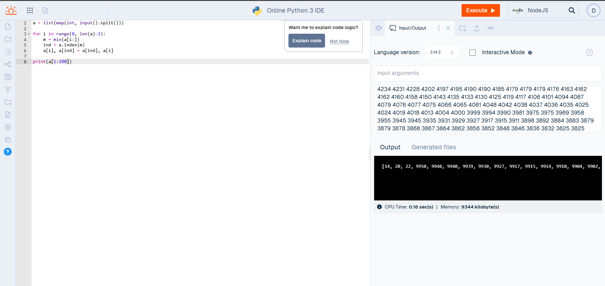

## Результати дослідження сортувань

| Набір тестових даних | Сортування вибором (час / памʼять)              | Сортування обміном (час / памʼять)              | Сортування включенням (час / памʼять)           | Швидке сортування (час / памʼять)                |
|----------------------|-------------------------------------------------|-------------------------------------------------|-------------------------------------------------|--------------------------------------------------|
| n = 100             | Memory: 8960 kilobyte(s)  CPU Time: 0.02 sec(s) | Memory: 8960 kilobyte(s)  CPU Time: 0.02 sec(s) | Memory: 8960 kilobyte(s)  CPU Time: 0.02 sec(s) | Memory: 9088 kilobyte(s)  CPU Time: 0.02 sec(s)  |
| n = 300             | Memory: 9216 kilobyte(s) CPU Time:0.02 sec(s)   | Memory: 8960 kilobyte(s)  CPU Time: 0.02 sec(s) | Memory: 8960 kilobyte(s)  CPU Time: 0.03 sec(s) | Memory: 9472 kilobyte(s)  CPU Time: 0.03 sec(s)  |
| n = 500             | Memory: 8960 kilobyte(s) CPU Time:0.04 sec(s)   | Memory: 8960 kilobyte(s)  CPU Time: 0.02 sec(s) | Memory: 8960 kilobyte(s)  CPU Time: 0.06 sec(s) | Memory: 10240 kilobyte(s)  CPU Time: 0.04 sec(s) |
| n = 1000            | Memory: 9088 kilobyte(s) CPU Time:0.05 sec(s)   | Memory: 9344 kilobyte(s)  CPU Time: 0.38 sec(s) | Memory: 9216 kilobyte(s)  CPU Time: 0.25 sec(s) | Memory: 13056 kilobyte(s)  CPU Time: 0.09 sec(s) |
| n = 1500            | Memory: 9472 kilobyte(s) CPU Time:0.10 sec(s)   | Memory: 9088 kilobyte(s)  CPU Time: 0.84 sec(s) | Memory: 9216 kilobyte(s)  CPU Time: 0.70 sec(s) | Memory: 18048 kilobyte(s)  CPU Time: 0.18 sec(s) |
| n = 2000            | Memory: 9344 kilobyte(s) CPU Time:0.16 sec(s)   | Memory: 9216 kilobyte(s)  CPU Time: 1.31 sec(s) | Memory: 9344 kilobyte(s)  CPU Time: 1.22 sec(s) | Memory: 24576 kilobyte(s)  CPU Time: 0.22 sec(s) |
Висновок - Під час виконання роботи було проаналізовано прямі методи сортування та алгоритм Quick Sort. Експериментально доведено:
Прямі методи (бульбашка, вибір, включення) демонструють квадратичну залежність часу від обсягу даних ($O(n^2)$). На реверсних масивах об'ємом $n=2000$ вони показали найнижчу ефективність, особливо метод «бульбашки».
Quick Sort є найшвидшим на середніх обсягах, проте у найгіршому випадку (відсортований масив) він також схильний до деградації швидкості та вимагає збільшення ліміту рекурсії (sys.setrecursionlimit).
Ресурсна ємність: Прямі методи економніші до оперативної пам'яті, тоді як рекурсивний Quick Sort створює додаткове навантаження на стек.
Підсумок: Для великих масивів у Python доцільно використовувати комбіновані методи (як-от Timsort) або оптимізований Quick Sort з рандомним вибором опорного елемента.
